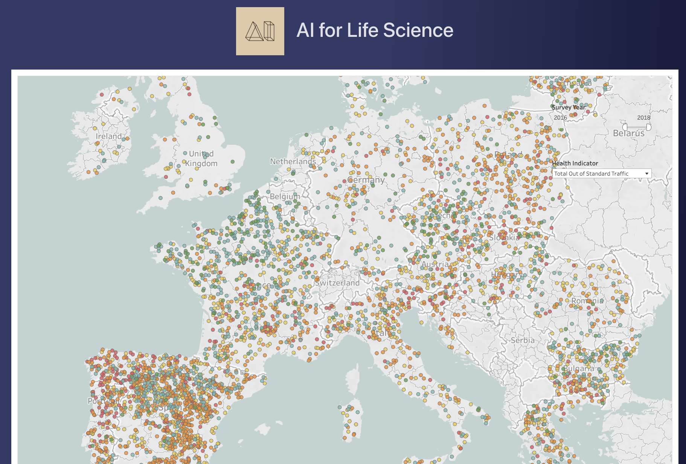
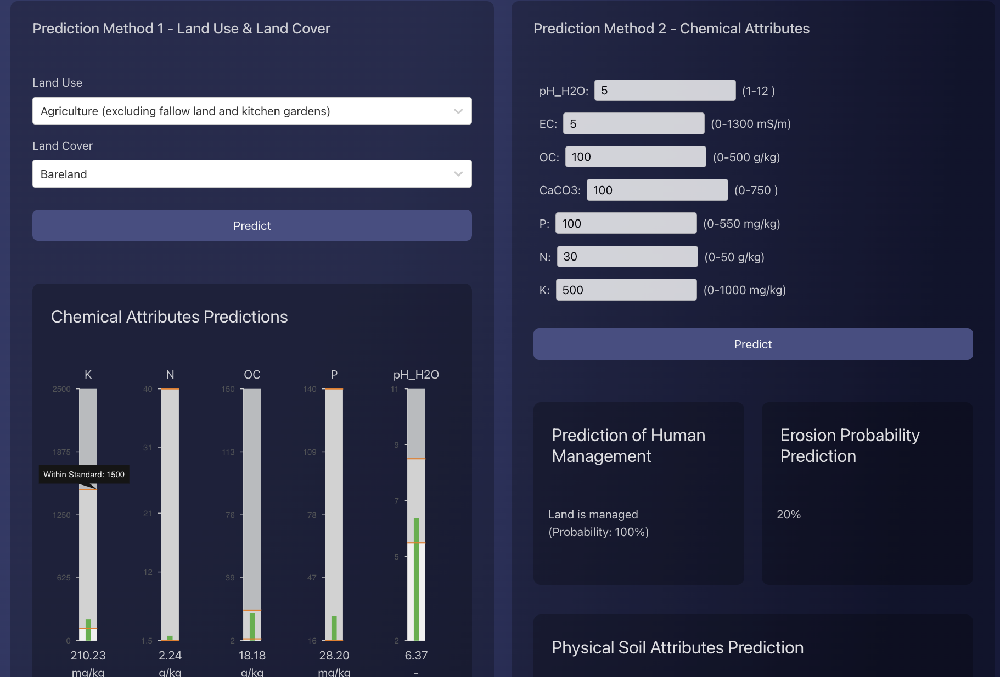

# This is the frontend for the AI4LS Hackathon

## Introductions
[AI for Life Sciences(2023)](https://ai4lifesciences.com/about/) is a challenge series connecting AI enthusiasts with organizations to apply AI in various life sciences domains like biology, genetics, and ecology. Participants work on real-world problems, using AI to create innovative solutions.

## About this Project
  - [Demo Website](http://13.213.141.140/) 
  - [Frontend](https://github.com/bobotangpy/AI4SL-Frontend)
  - [Backend](https://github.com/justinlctstudy96/ai4ls_backend/tree/main)
  - [Data tools](https://github.com/morganluuuu/AI4LS/tree/main)
    

Please also clone the [backend repository](https://github.com/justinlctstudy96/ai4ls_backend) in order to start the whole project

## To run this project, follow these steps:

### Fist clone this project

Then install the modules needed:
### `yarn install`

Finally, start the project:
### `yarn start`
